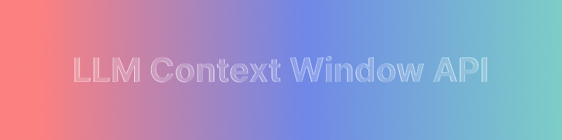

# Context Window API

An API for querying AI model context window lengths. On the first request, it calls the artificialanalysis.ai API and stores the result in KV. Subsequent requests for the same model return the cached value from KV.



## Base URL

```
https://lcw-api.blp.sh
```

## Endpoints

### 1. Get Context Window

Query context window by model name.

**GET** `/context-window?model={modelName}`

**Query Parameters**

| Parameter | Type | Required | Description |
|-----------|------|----------|-------------|
| model | string | Yes | AI model name (e.g., `gpt-5.3-codex`, `claude-opus-4.6`) |

**Example Request**

```bash
curl "https://lcw-api.blp.sh/context-window?model=gpt-4"
```

**Success Response (200)**

```json
{
  "success": true,
  "data": {
    "name": "GPT-4",
    "contextWindow": 8192,
    "slug": "openai-gpt-4",
    "creator": "OpenAI",
    "fromCache": false
  }
}
```

**Cached Response**

```json
{
  "success": true,
  "data": {
    "name": "gpt-4",
    "contextWindow": 8192,
    "fromCache": true,
    "lastUpdated": "2024-01-15T10:30:00.000Z"
  }
}
```

**Error Response (404)**

```json
{
  "success": false,
  "error": "Model not found: gpt-4"
}
```

---

### 2. Health Check

**GET** `/health`

**Response (200)**

```json
{
  "status": "ok"
}
```

---

## Model Name Normalization

All of the following inputs are treated as the same model:

- `gpt-4` = `gpt 4` = `GPT-4` = `gpt_4`
- `claude-3-opus` = `claude 3 opus` = `Claude-3-Opus`

---

## Deployment

```bash
# Create KV namespace
wrangler kv:namespace create MODEL_CACHE

# Update KV id in wrangler.toml, then deploy
wrangler deploy
```

### Custom Domain

The API uses a custom domain configured in `wrangler.toml`:

```toml
routes = [
  { pattern = "lcw-api.blp.sh", custom_domain = true }
]
```

With `custom_domain = true`, Cloudflare automatically:
- Creates the necessary DNS records
- Issues SSL certificates

Just run `wrangler deploy` and the domain will be set up automatically.

---

## Environment Variables

| Variable | Required | Description |
|----------|----------|-------------|
| ARTIFICIAL_ANALYSIS_API_KEY | Yes | artificialanalysis.ai API key (get it from [artificialanalysis.ai](https://artificialanalysis.ai)) |

**Get API Key:** Sign up at [artificialanalysis.ai](https://artificialanalysis.ai) and generate an API key from the Insights Platform. |
